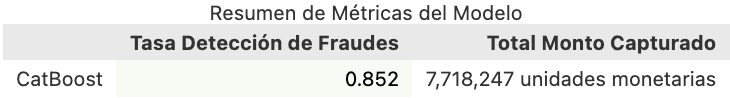
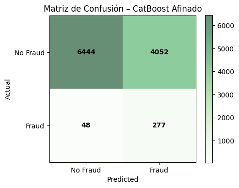

# Desafío HDI – Modelo de Detección de Fraudes

## Contenidos
1. [Introducción](#introducción)  
2. [Estructura del Proyecto](#estructura-del-proyecto)  
3. [Metodología (CRISP-DM)](#metodología-crisp-dm)  
4. [Preparación de Datos](#preparación-de-datos)  
5. [Modelado y Evaluación](#modelado-y-evaluación)  
6. [Scoring y Métricas](#scoring-y-métricas)  
7. [Resultados Finales](#resultados-finales)
8. [Cómo ejecutar](#cómo-ejecutar)
9. [Requisitos](#requisitos)
10. [Documentación Detallada](#documentación-detallada)  

---

## 1. Introducción
El área de fraude de HDI Seguros requiere un modelo predictivo que, al momento de la denuncia de un siniestro, asigne un score de probabilidad de fraude. Con ese score se revisarán solo el **40 %** de los casos más riesgosos, optimizando el uso del equipo y maximizando la detección sin perder precisión.

---

## 2. Estructura del Proyecto
```text
desafio_HDI/
│
├── data/                    # Datos originales y procesados
│   ├── raw/                 # Datos crudos (sin modificar)
│   └── processed/           # Datos limpios y datos pasados por el modelo.
│
├── notebooks/               # Jupyter Notebooks para exploración y análisis
│
├── src/                     # Código fuente: funciones reutilizables
│   ├── data_prep.py         # Limpieza y preparación de datos
│   ├── modeling.py          # Entrenamiento y evaluación de modelos
│   └── scoring.py           # Cálculo de métricas de performance
│
├── outputs/                 # Resultados del proyecto
│   ├── figures/             # Gráficos y visualizaciones
│   └── models/              # Modelos serializados (por ejemplo, .pkl)
│
│
├── docs/                    # Documentación adicional (metodología, info del desafío, etc)
│
├── requirements.txt         # Librerías necesarias para reproducir el entorno
├── main.py                  # Script principal para ejecutar el pipeline completo
└── README.md                # Guía inicial y estructura del proyecto
```

## 3. Metodología (CRISP-DM)
1. **Business Understanding**  
   - Ordenar siniestros por probabilidad de fraude para que el equipo revise solo el 40% más riesgosos.  
2. **Data Understanding & Preparation**  
   - Limpieza de nulos, encoding, creación de lag, selección de las 6 features principales.  
3. **Modeling**  
   - Entrenamiento de CatBoost con `class_weight="balanced"` y calibración sigmoid.  
4. **Evaluation**  
   - Métricas focus: recall@40% y monto capturado.  
5. **Deployment (Scoring)**  
   - Script `scoring.py` que carga el modelo, genera scores y produce reportes.

---

## 4. Preparación de Datos
- Eliminación de casos “No revisados” y mapeo del target (`fraude_bin`).  
- Imputaciones (hijos, año vehículo, fechas).  
- Target Encoding para `PRODUCTO` y `MARCA_VEHICULO`.  
- One-Hot para `ESTADO_CIVIL`, `DEDUCIBLE` y `CANAL_CONTRATACION`.  
- Escalado y eliminación de leakage (`monto_fraude`, `claim_id` temporal).  
- Resultados guardados en `data/processed/fraud_prepared_with_id.csv`.

---

## 5. Modelado y Evaluación
- **Modelo final:** CatBoostClassifier afinado y calibrado con `CalibratedClassifierCV`.  
- **Train/Test:** Validación temporal (TimeSeriesSplit) y métricas de entrenamiento/backtest.  
- **Selección de umbral:** percentil 60 para simular revisión del 40 %.  
- **Resultados iniciales:** ROC-AUC, PR-AUC y comportamiento de recall/precision.  

---

## 6. Scoring y Métricas
El script `src/scoring.py`:
1. Carga `fraud_prepared_with_id.csv` y el modelo serializado.  
2. Calcula **recall@40%**, la **matriz de confusión** y el **monto capturado**.  
3. Genera:  
   - Gráfico de matriz de confusión con paleta verde pastel.  
   - Gráfico de métricas (texto en fondo pastel).  
   - CSV `predicted_frauds.csv` con todos los casos marcados como fraude (`claim_id`, `score`, `monto_fraude`).  
   - Tabla Top-10 impresión en Markdown.

---

## 7. Resultados Finales





---

## 8. Cómo ejecutar
git clone <(https://github.com/joacomartineeez/desafiohdi_joaquinmartinez.git>
cd desafio_HDI
python3 -m venv .venv && source .venv/bin/activate
pip install -r requirements.txt
python main.py

---
## 9. Requisitos
- pandas
- numpy
- scikit-learn
- catboost
- matplotlib
- category_encoders
- joblib

---

## 10. Documentación Detallada

Para el proceso completo paso a paso, análisis de datos y resultados intermedios, consulta:
[Documentación detallada](docs/documentacion_modelo.md)
