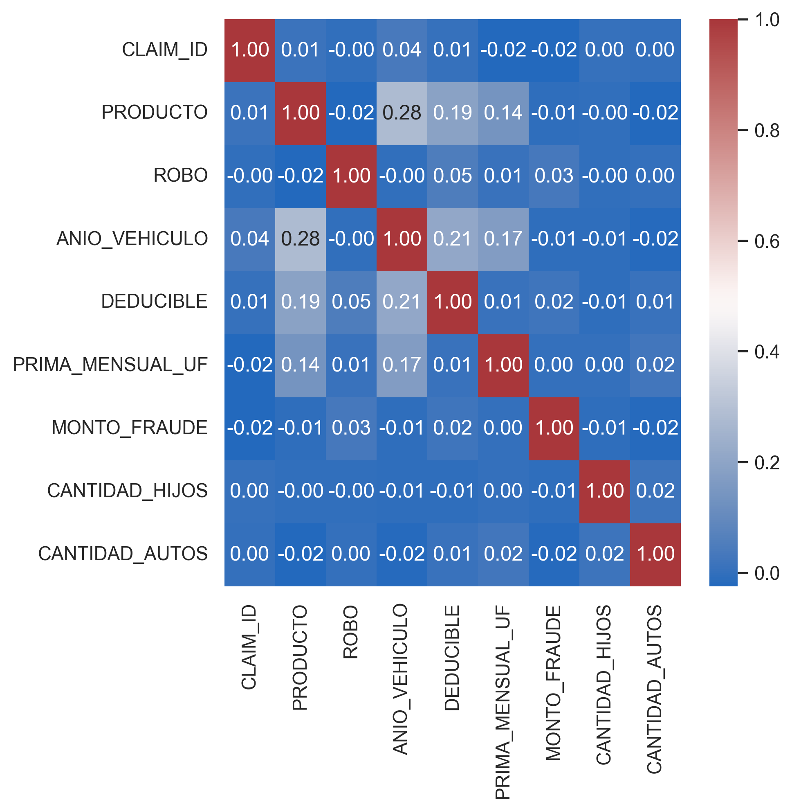
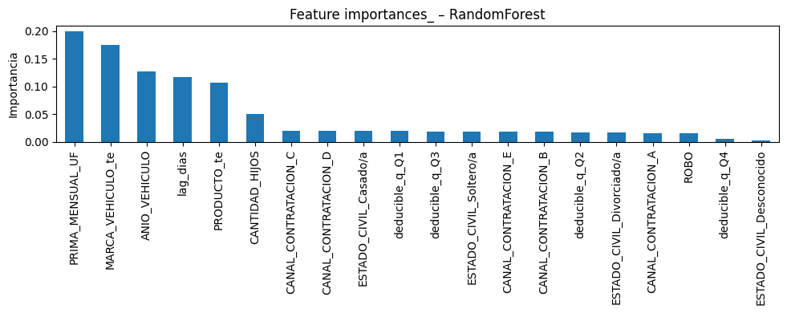
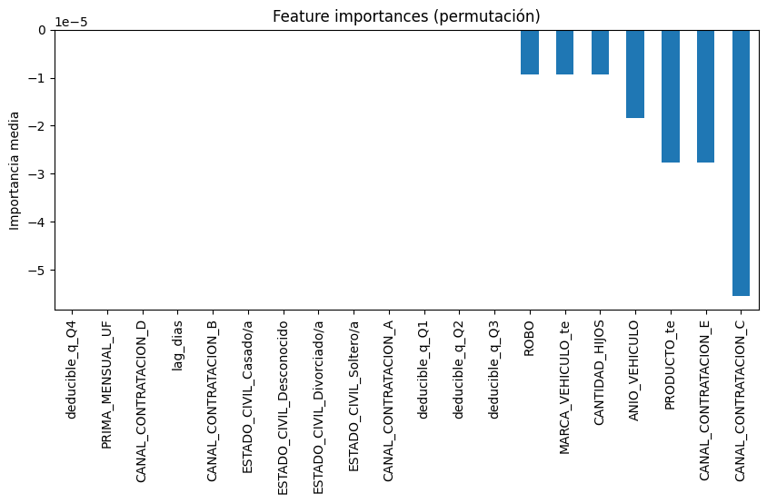
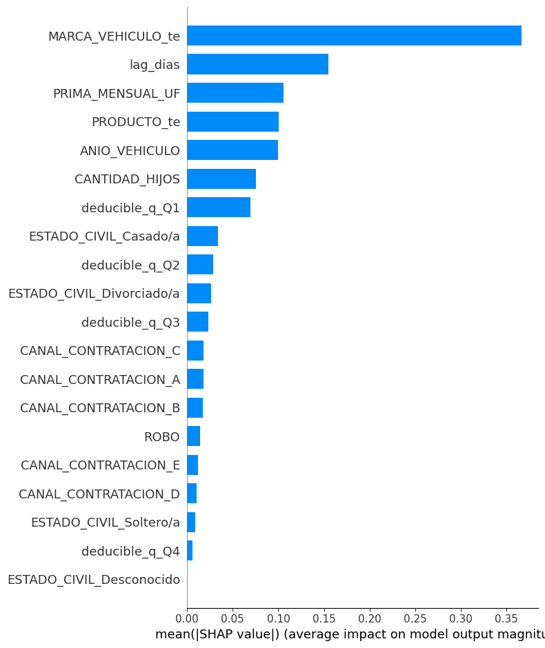
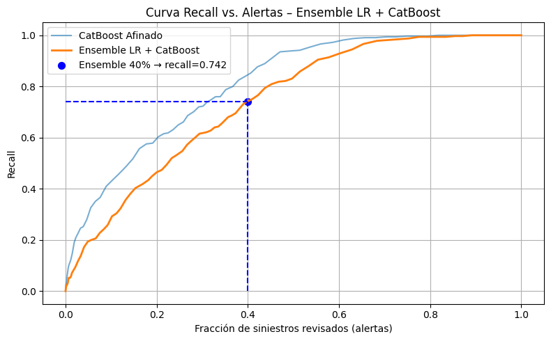

Para llevar a cabo el desafio decidí trabajar con la metodología CRIPS-DM. Esto porque abarca todo el ciclo de vida del desafio, y además, es la forma de trabajar que aprendí en el curso de Data Science IBM.

# 1. Business Understanding
Ordenar los siniestros según su **probabilidad o score de fraude**, de mayor a menor, para que el equipo de fraude priorice la revisión de los casos más relevantes.


# 2. Analytic Approach
Trabajar con los siniestros **ya revisados** por el área de fraude, buscando patrones diferenciadores entre los casos **Descartados** (no fraude) y los **Fraude** confirmados.


# 3. Data Requirements
Se necesita el historial de siniestros con su estado final (Fraude / Descartado), más las variables operativas asociadas, para entrenar un modelo supervisado.


# 4. Data Collection
Para este desafío de HDI se entregó un único dataset **`fraud_dataset.csv`**; no fue necesario obtener fuentes externas.


# 5. Data Understanding
## Iteración n° 1
### 5.1 Descripción general
| Aspecto | Valor |
|---------|-------|
| Filas totales | 28 281 |
| Columnas originales | 15 |
| Periodo | oct‑2024 → mar‑2025 |
| Objetivo (`FRAUD`) | Fraude / Descartado / No revisado |

### 5.2 Variable objetivo (`FRAUD`)
| Clase | Recuento | Proporción |
|-------|----------|------------|
| No revisado | 17 460 | 61.7 % |
| Descartado | 10 496 | 37.1 % |
| Fraude | **325** | **1.1 %** |

> **Observación:** la clase positiva (“Fraude”) está fuertemente desbalanceada.

### 5.3 Valores nulos (top 6)
| Columna | % nulos | Acción propuesta |
|---------|---------|------------------|
| `CANTIDAD_AUTOS` | 89.7 % | Eliminar |
| `CANTIDAD_HIJOS` | 10.0 % | Imputar mediana |
| `ANIO_VEHICULO` | 2.1 % | Imputar mediana |
| `FEC_SINIESTRO` | 1.25 % | Imputar con `FEC_DENUNCIO` |
| `PRODUCTO` | 1.2 % | Rellenar “Desconocido” |
| `MARCA_VEHICULO` | 1.0 % | Rellenar “Desconocido” |

### 5.4 Fechas y lag
* `FEC_DENUNCIO`: completo, sin nulos.  
* `FEC_SINIESTRO`: 354 nulos y un outlier en 2007. 

### 5.5 Correlaciones numéricas (Spearman)


> **Observación:**  
> - La correlación más alta entre pares de variables numéricas es de ρ ≈ 0.28 (`PRODUCTO` vs. `ANIO_VEHICULO`), seguida de ρ ≈ 0.21 (`DEDUCIBLE` vs. `ANIO_VEHICULO`).  
> - Ningún par alcanza |ρ| ≥ 0.30, por lo que **no se detecta multicolinealidad fuerte**.  
> - Conservaremos todas las variables numéricas para la fase de modelado, reservando la selección final para cuando evaluemos los modelos.  


### Puntos a llevar a la fase _Data Preparation_
- **Excluir datos _No etiquetados_**  
  - Para entrenar el modelo, se descartarán los casos “No revisados” de la variable `FRAUD`. Porque:  
    - No cuentan con etiqueta confirmada de “Fraude” o “No fraude”, imprescindible para un modelo supervisado.  
    - Incluir ejemplos sin etiqueta introduciría ruido y degradaría la calidad del entrenamiento y de las métricas de evaluación.

- **Desbalance severo de clases** (`Fraude` ≈ 1 %) → usar `class_weight="balanced"` y evaluar métricas PR‑AUC.

- **Fechas**  
  - Convertir `FEC_SINIESTRO` y `FEC_DENUNCIO` a `datetime`.  
  - Crear y analizar `lag_dias` (denuncia − siniestro).

- **NULOS: Estrategia de imputación / eliminación**

  -CANTIDAD_AUTOS (89.7 % nulos)
  - 89.73 % de valores faltantes, con una tasa de missing similar en “Fraude” (~90.15 %) y “Descartado” (~89.57 %), por lo que no aporta señal discriminativa y se eliminará.

  -CANTIDAD_HIJOS (10% nulos):  
  - Se detectó el valor atípico `999`, que representa un placeholder inválido en vez de un conteo real.
  - Para tratarlo de forma homogénea con los otros missings, se reemplazará `999` por `NaN`, convirtiéndolo en valor faltante.   
  - Δ pequeño y p-value alto indican que el missing no es informativo. Por lo que solo imputará se imputará con la moda (0 hijos), ya que es el valor más frecuente y permite conservar la mayoría de los datos sin introducir sesgo.

  -ANIO_VEHICULO (2.1 % nulos)
  - Imputar mediana de los años de fabricación.

  -FEC_SINIESTRO (1.25 % nulos)
  - Imputar con FEC_DENUNCIO (cuando falta la fecha de siniestro, asumimos que se denunció el mismo día).

  -PRODUCTO (1.2 % nulos)
  - Imputar nulos con categoría "Desconocido" y luego agrupar categorías, que tengan <1% del total,  en "Otros". Buscando evitar Overfitting y valores extremos que desproporcionen el feature.
  - Aplicar Target Encoding, para reducir dimensionalidad y capturar directamente la relación de cada producto con la probabilidad de fraude.

  -ESTADO_CIVIL (1.0 % nulos)
  - Rellenar “Desconocido”, unificar categorías repetidas (ej. casado con casado/a y divorciado con divorciado/a lo mismo).
  - Aplicar One-Hot Encoding, por la interpretabilidad y porque solo son 4 dummies.

  -MARCA_VEHICULO (1.0 % nulos)
  - Rellenar “Desconocido”.
  - Aplicar Target Encoding.

  -PRIMA_MENSUAL_UF (0.7 % nulos)
  - Imputar mediana de la prima mensual.

- **Cambio del data type:**
  - Fechas: datetime64[ns]
  - Categorías (PRODUCTO, ROBO, MARCA_VEHICULO, FRAUD, etc.): category
  - Enteros (ANIO_VEHICULO, CANTIDAD_*): int64
  - Continuas (DEDUCIBLE, PRIMA_MENSUAL_UF, MONTO_FRAUDE) → float64

- **Numerical features**  
  - Evaluar agrupar `DEDUCIBLE` en cuartiles/quintiles para análisis.  
  - Escalar numéricas (StandardScaler) si el modelo lo requiere.


- **Columnas a eliminar:**
  - `MONTO_FRAUDE`: leakage.
  - `CLAIM_ID`: identificador único, no aporta señal.

- **Trabajo de variables:**
- `FRAUD`: mapear a binario.
- `CANAL_CONTRATACION`: one - hot
- `DEDUCIBLE`: binning cuantílico (en esta primera iteración)


# 6. Data Preparation
¿
- Se aplicó todo lo pensando en _Data Understanding_, PERO se modificó lo siguiente:
  - `DEDUCIBLE`: el plan era que quedara en cuartiles, lo cual se hizo pero además se aplico One-Hot Encoding a esos cuartiles. Ya que al querer modelar arrojaba error.

### Selección de Features

Para simplificar el modelo y mejorar su interpretabilidad, realizamos una **reducción de variables** basada en tres métodos de importancia:

1. **Importancia nativa de RandomForest**  
   - Entrenamos un `RandomForestClassifier` (100 árboles, `class_weight="balanced"`) sobre todo el dataset procesado.  
   - Extraímos `feature_importances_` para obtener un ranking rápido.

  

2. **Importancia por permutación (HistGradientBoosting)**  
   - Entrenamos un `HistGradientBoostingClassifier` de referencia.  
   - Con `permutation_importance` medimos la caída en ROC-AUC al permutar cada variable (10 repeticiones).

  

3. **SHAP (TreeSHAP)**  
   - Con el mismo HGB, usamos `shap.TreeExplainer` para calcular valores SHAP globales.  
   - Generamos un `summary_plot` de magnitudes medias de SHAP para cada feature.

  

Al comparar los tres rankings, las **6 variables** con señal consistente fueron:

- `MARCA_VEHICULO_te`  
- `lag_dias`  
- `PRIMA_MENSUAL_UF`  
- `PRODUCTO_te`  
- `ANIO_VEHICULO`  
- `CANTIDAD_HIJOS`  

El resto mostraba importancias muy bajas o inconsistentes entre métodos, indicando que su presencia no mejora (o incluso empeora) la métrica principal (ROC-AUC).

### Columnas Eliminadas
- deducible_q_Q1, deducible_q_Q2, deducible_q_Q3, deducible_q_Q4  
- ROBO  
- ESTADO_CIVIL_Casado/a, ESTADO_CIVIL_Divorciado/a, ESTADO_CIVIL_Soltero/a, ESTADO_CIVIL_Desconocido  
- CANAL_CONTRATACION_A, CANAL_CONTRATACION_B, CANAL_CONTRATACION_C, CANAL_CONTRATACION_D, CANAL_CONTRATACION_E  

### Motivo:
- Estas features aparecían en el fondo del ranking (importancia ≈ 0 o negativa) según RandomForest, permutación y SHAP.
- Permutarlas a veces mejoraba la métrica, señal de que generaban ruido u overfitting.
- Al eliminarlas, reducimos dimensionalidad sin pérdida de perfomance.


---
---
---
# 7. Modeling & Evaluation

### 7.1 Modelos iniciales
Entrenamos inicialmente cuatro modelos y evaluamos **recall@40%** (tasa de detección en el 40 % más riesgoso). Para todos, usamos *TimeSeriesSplit* (4 folds) y calibración *sigmoid* en LightGBM y CatBoost.

| Modelo             | Recall@40% | ±Std       | Umbral medio |
|--------------------|-----------:|-----------:|-------------:|
| LR_L1              | 0.603      | 0.074      | 0.498        |
| LR_L2              | 0.541      | 0.046      | 0.513        |
| LightGBM           | 0.449      | 0.110      | 0.033        |
| CatBoost           | 0.486      | 0.102      | 0.034        |

> **Observación:** Los boosters sin tuning (LightGBM y CatBoost) quedan por debajo de las regresiones lineales.

---

### 7.2 Calibración de Boosters y Threshold Tuning
Calibramos probabilidades (*CalibratedClassifierCV*, método `sigmoid`) y ajustamos umbral al 60º percentil para maximizar recall@40%.

| Modelo             | Recall@40% (cal) | ±Std    | Umbral medio |
|--------------------|-----------------:|--------:|-------------:|
| LightGBM (cal)     | 0.488            | 0.091   | 0.111        |
| CatBoost (cal)     | 0.504            | 0.115   | 0.336        |

> **Observación:** La calibración mejora ligeramente LightGBM y CatBoost, pero siguen por debajo de LR_L1.

---

### 7.3 Hiperparámetros Óptimos de CatBoost
Ejecutamos **RandomizedSearchCV** con *TimeSeriesSplit* para optimizar recall@40%. Espacio de búsqueda:
- `depth`: [4, 6, 8, 10]
- `learning_rate`: [0.001, 0.01, 0.05, 0.1]
- `l2_leaf_reg`: [1, 3, 5, 10]
- `bagging_temperature`: [0, 0.3, 0.7, 1.0]
- `border_count`: [32, 64, 128]

> **Mejores parámetros encontrados:**
> ```
> depth = 10
> learning_rate = 0.001
> l2_leaf_reg = 10
> bagging_temperature = 1.0
> border_count = 32
> ```

---

### 7.4 Evaluación Final del Modelo Afinado
Entrenamos el CatBoost afinado sobre todo el dataset y calibramos nuevamente:

- **Recall@40%** final: **0.852**  
- **Umbral**: **0.0314**  

**Matriz de confusión (sumatoria de folds):**

```
          Predicted
Actual    No Fraud   Fraud
No Fraud    6444      4052
Fraud         48       277
```

> **Interpretación:**
> - Capturamos el **85.2 %** de los fraudes revisando el 40 % de los casos.  
> - Solo **48** fraudes quedaron sin detectar y se marcaron **4 052** falsos positivos.

---

### Resumen:
1. **Performance**: Recall@40% sube de 0.603 (LR_L1) a **0.852** con CatBoost afinado.
2. **Operacional**: Umbral = 0.0314 → ~4 100 alertas para 277 fraudes.

---

### LR + CatBoost y curva recall vs. alertas



> Con media 50/50 el recall@40% cae a 0.742, indicativo de dilución de la señal fuerte de CatBoost.
---

### Calculo de **monto capturado**
> Se necesitaba que el score de los fraudes encontrados estuvieran asociados a su claim_id y monto capturado *correspondiente*.

Para eso se modificó el código de _Data Preparation_: se agregó a los 6 features más importantes, es decir, no se eliminaron las columnas CLAIM_ID Y MONTO_FRAUDE.

- Al cargar este nuevo dataset, se separa de la siguente forma:
X         = df_proc[[
  'MARCA_VEHICULO_te','lag_dias','PRIMA_MENSUAL_UF',
  'PRODUCTO_te','ANIO_VEHICULO','CANTIDAD_HIJOS'
]]
y         = df_proc['fraude_bin']
claim_ids = df_proc['claim_id']
montos    = df_proc['monto_fraude']

- Y tras predecir las probabilidades:
proba_cb = calib_cb.predict_proba(X)[:,1]
scores = pd.DataFrame({
  'claim_id':     claim_ids,
  'score':        proba_cb,
  'fraud':        y,
  'monto_fraude': montos
})

> Cada score va unido a su ID y su monto, garantizando trazabilidad en todo el pipeline.


# Resultados Finales


